## **Property Rental Price Prediction**

####  Airbnb, Inc. is an American company that operates an online marketplace for lodging, primarily homestays for vacation rentals, and tourism activities.  Millions of hosts and travelers choose to create a free Airbnb account so they can list their space and book unique accommodations anywhere in the world. A price predictions tool for Airbnb could help hosts make impactful decisions about how much to charge for their listings.  This tool will help them remain competitive in their market and calculate revenue from their rentals.  

#### This price prediction tool can be good for :

- #### Homeowners looking to offer competitive prices for their rentals

- #### Market analysis tool for real estate owners and inventors (and future owners and investors) such as me!

- #### Accommodations pricing comparison tool for Travelers for travel planning

#### **Why I chose this project?**
#### I chose this project because I am in the process of buying a property in New York City although I live in California.  I would like to list this property on Airbnb.  I am also an experienced world traveler who traveled to 50+ countries between 2014-2020.   I spent much of my time in Airbnb rentals so this is a topic that I understand very well.  

---

---
## **Data Exploration**
While looking through the raw data, I noticed there were zero values that should not be in columns like price, minimum nights, availability.  My initial thought was that they may need to be dropped or replaced.  I also saw that the features seem to be already in the appropriate data types, except for the "last_reviews" column which should be in the datetime format. I visualized the correlation before before transforming the data to be able to compare the two heatmaps after transforming the data.  The top heatmap is before making changed to the dataset and the bottom heatmap is after those changes were made.  I knew I would need to put numerical weights on the values in the columns with values that occur often for example: "room type" and "neighborhood. 

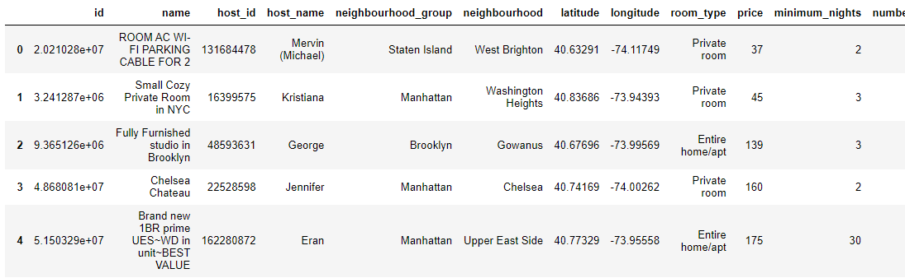
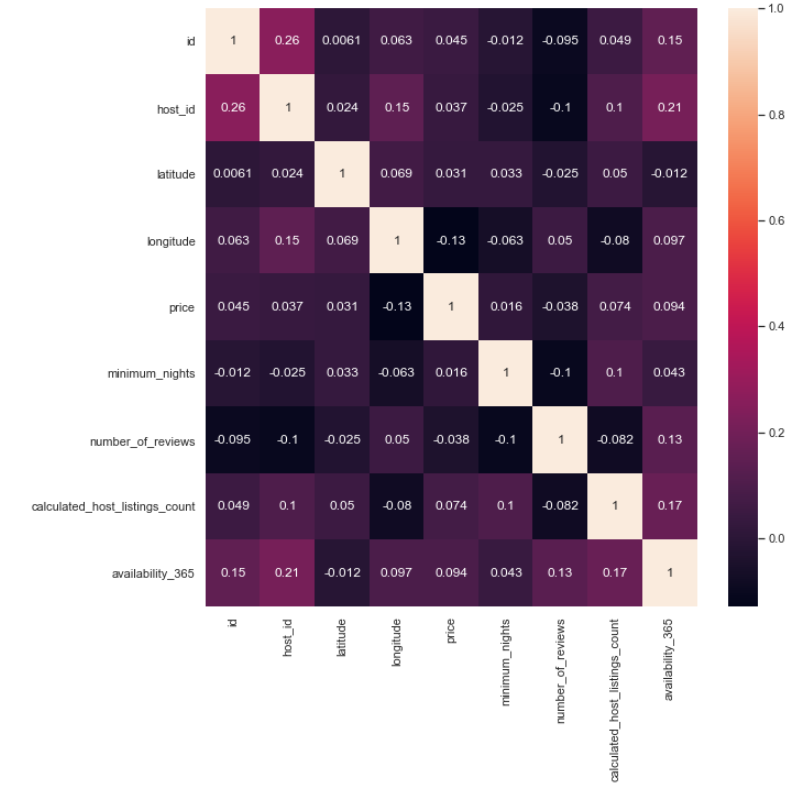
 
 There is a strong negative correlation between "room_type" and "price". As the room type on the weighted scale goes down, the price goes up.  
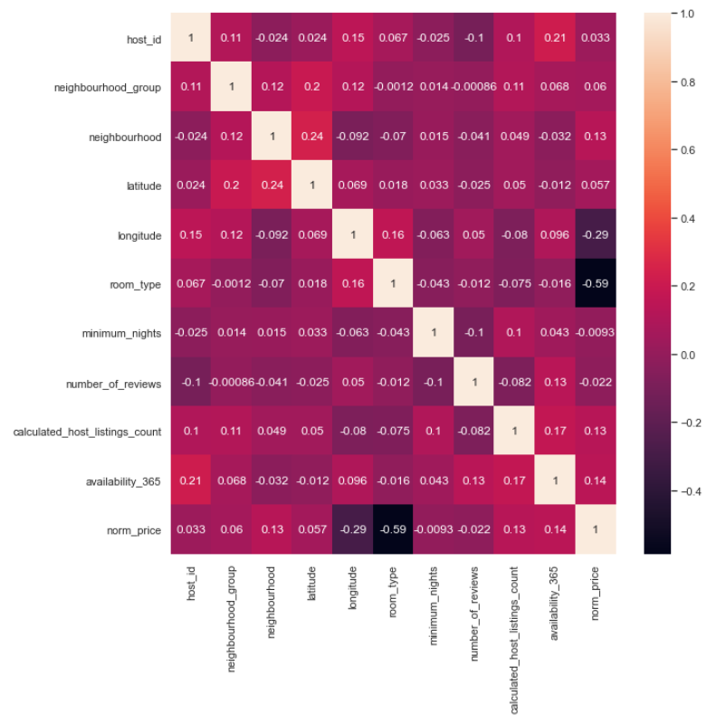

---
## ** Data Analysis**

Which property type had the most listings?
Apartments and Entire home had the most listings. This could be as a result of more family/friends vacations, than solo trips during the pandemic since everyone was home.

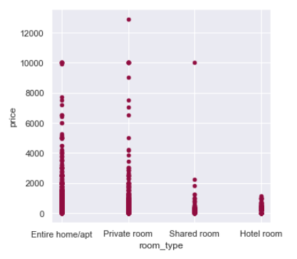

How are the properties priced? 
The majority of houses are priced between USD0 and USD2000. The max price for houses in Queens, Brooklyn and Bronx is USD10k. Staten Island has a little above USD5000 as max price and Manhattan, a little above USD12000. 

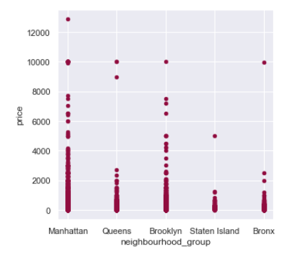

How are the properties distributed in the neighborhood? 
Manhattan has the most properties listed, closely followed by Brooklyn. Stanten Island has the least.

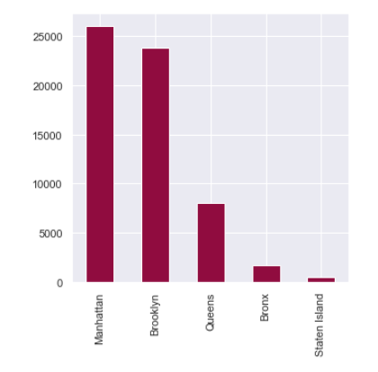

The price is not a normal distribution,  as a result of high priced listings.  The price values will need to be transformed. I normalised the distribution using the log values of the original prices and change the price back to the normal price later.

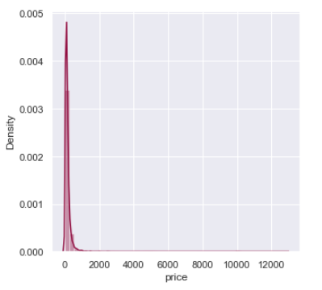
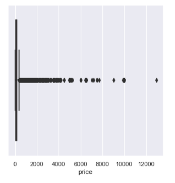

Below is a a near normal distribution of the transformed price.

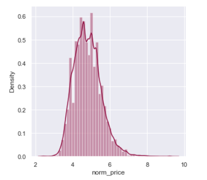

---
## **Feature Selection and Model Selection**

I used the Random Forest Regressor to determine feature importance and filter out unimportant features. The Random Forest regressor concluded that the "neighbourhood_group' feature had the least importances.  Then I trained other models with and without the least “neighborhood_group to measure accuracy. 

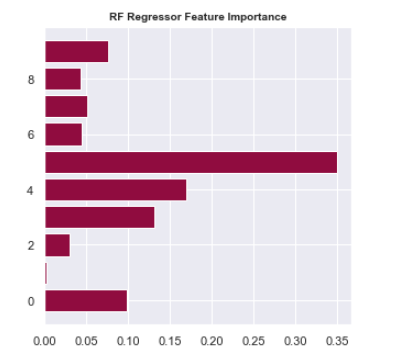

Three Regression models were used to fit the data, and select the most efficient model. I measured the performance of Random Forest Regressor, XGB Regressor, Linear Regression,  with all the features and then again with less features.  I used R2 and MSE (mean squared error) to measure accuracy.  The Random Forest Regressor model without the less important features had the best MSE accuracy score

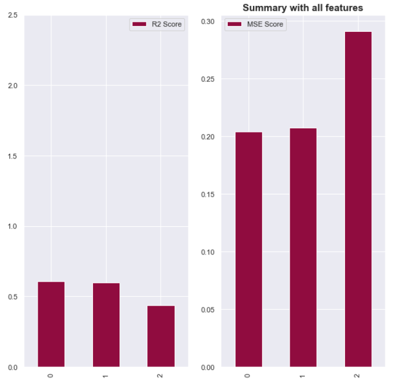
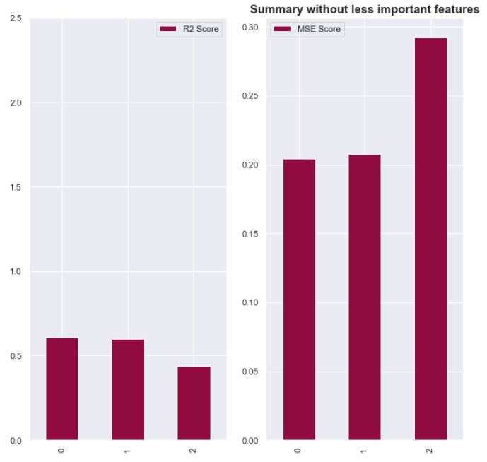

---
## **Connecting to the Database**
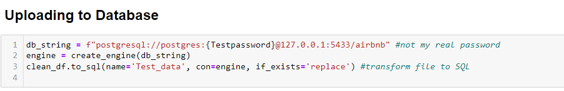
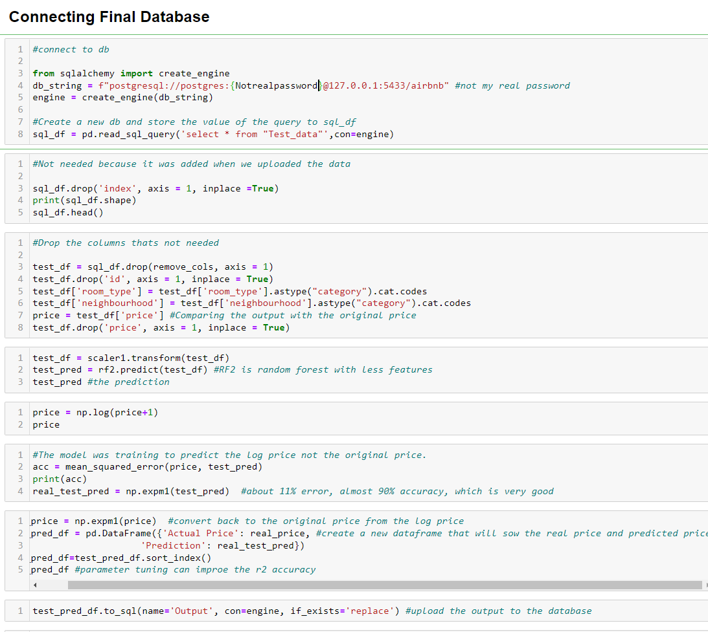

---
## **Dashboard and Presentation**

#### Link to Tableau dashboard - https://public.tableau.com/views/AirbnbListings_16629365304590/Dashboard1?:language=en-US&:display_count=n&:origin=viz_share_link
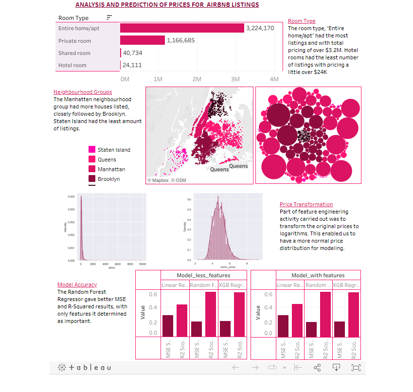

#### Link to Airbnb Price prediction presentation (Google Slides) - https://docs.google.com/presentation/d/1c2BxgpvZix_ihc0f0i20Z-8WYg32zfk1L703fofE_Gs/edit#slide=id.g15013174d24_0_80
